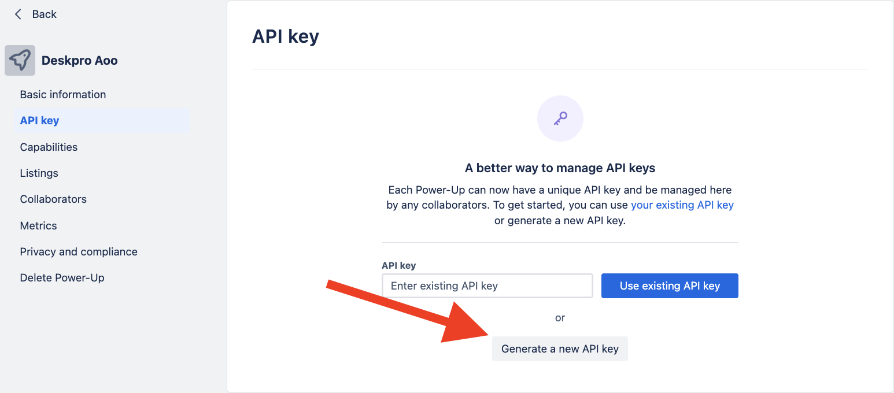
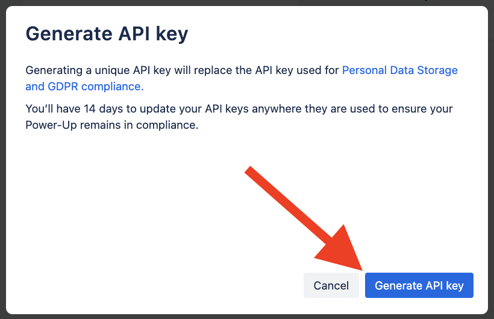

# Trello App Setup

To install the Trello app you must first get your API Key. To do this, login to your Trello account and go to [https://trello.com/power-ups/admin](https://trello.com/power-ups/admin).

You'll see a button labelled __New__, click it to create the Integration.

Next fill in the required information:

* __New Power-Up or Integration__: this can be anything, something like "Deskpro App" will do
* __Workspace__: making sure to select the workspace you'd like to give access to
* __Iframe connector URL__: can leave empty
* __Email, Support contact, Author__: Contact info for you and your support

When all fields are filled in, click "Create" to create a new Integration, and then we need to "Generate a new API key"

Confirm our choice

Next, we'll need to provide Trello with your Deskpro URL. Click the integration you just created, and navigate to the "API key". Enter your Deskpro URL in the "Allowed Origins" field (_You can copy it in the Trello settings on the settings tab_).

Click "Add" to add the new allowed origin.

Head back over to Deskpro and in the **Settings** tab of the app, enter the API Key you copied during creating Integration and paste it into the "API Key" field.

To configure who can see and use the Trello app, head to the "Permissions" tab and select those users and/or groups you'd like to have access.

When you're happy, click "Install".
